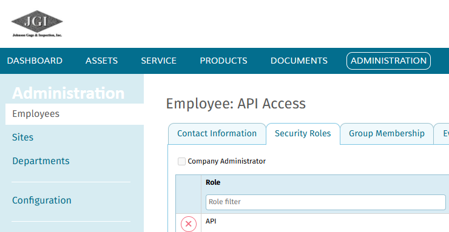

<p align="center">
    <!--  -->
</p>
<p align="center"><h1 align="center">PDF Processor and Uploader</h1></p>
<p align="center">
  <em>Streamline PDF uploads for seamless Qualer connections.</em>
</p>
<p align="center">
  
  
  
  
</p>
<p align="center"><!-- default option, no dependency badges. -->
</p>
<p align="center">
  <!-- default option, no dependency badges. -->
</p>
<br>

##  Table of Contents

<!-- TOC -->

- [Table of Contents](#table-of-contents)
- [Overview](#overview)
- [Features](#features)
- [Project Structure](#project-structure)
    - [Project Index](#project-index)
- [Getting Started](#getting-started)
    - [Prerequisites](#prerequisites)
    - [Installation](#installation)
    - [Configuration](#configuration)
- [Usage](#usage)
    - [Starting the program:](#starting-the-program)
        - [Run with Python:](#run-with-python)
        - [Run executable:](#run-executable)
    - [Operation Overview](#operation-overview)
- [Contributing](#contributing)
- [Acknowledgments](#acknowledgments)

<!-- /TOC -->

## Overview

The pdfuploader project is designed to simplify the process of uploading scanned documents to Qualer. It features a robust architecture with key components such as file processing tools, connectivity checks, and archive management. The project aims to provide a seamless user experience by handling various scenarios, including successful uploads, failed uploads, and file renaming, while ensuring compatibility across different environments and platforms.

---

##  Features

|      | Feature         | Summary       |
| :--- | :---:           | :---          |

| **PDF Correction** |  *   Backup OCR if not provided by the scanner.  *   Ensure PDFs are upright by detecting and correcting orientation.  *   Split multi-page PDFs into separate files when a new work order number is detected.|

| **Automatic Triggers** |  *   Automatically watch directories for new PDFs.  *   Identify document type based on source, contents, or filename.  *   Archive or delete processed files based on settings.  *   Handle file renaming to avoid conflicts.|
| **Integration** |  *   Upload PDFs to the Qualer API with detailed logging.  *   Retry and resolve naming conflicts during uploads. |

| ⚙️ **Architecture** |  *   Modular design with separate modules for API gateway, file processing, and configuration.  *   Utilizes a centralized `config.py` file for configuration data.  *   Employs an error handling system using `cp.red`.  *   Supports live or staging API usage, file uploads or skips, and deletion or archiving of processed files. |
| 📚 **Documentation** |  *   Provides detailed documentation for each module, including script instructions, functions, and error handling mechanisms.  *   Includes a comprehensive overview of the project's architecture and functionality.  *   Offers concise response guidelines for user interactions.  *   Utilizes Markdown formatting for easy readability. |
| 📊 **Data Processing** |  *   Employs data processing techniques to extract relevant pages from PDFs, including `extract`, `workorders`, and `create_child_pdf` functions.  *   Supports file rename errors using the `try_rename` function.  *   Utilizes an API token to fetch service orders and update a dictionary of purchase orders (POs).  *   Compresses data for storage in compressed JSON files. |
| 🌐 **Connectivity** |  *   Verifies internet availability by pinging Google's address.  *   Checks accessibility of SharePoint and Qualer servers.  *   Verifies the existence of the SharePoint directory.  *   Provides real-time feedback on system connections for informed decision-making. |
| 💻 **Development Tools** |  *   Utilizes Python as the primary programming language.  *   Employs the `colorama` library for colorized logging.  *   Incorporates PyInstaller for packaging and deployment.  *   Supports PyMPDF, PDF, Pillow, and PdF2Imagick libraries for PDF processing. |
| 📁 **Configuration** |  *   Utilizes a centralized `config.py` file for configuration data.  *   Configures API endpoints, directory paths, and upload settings for the project.  *   Specifies document types for Qualer API uploads.  *   Offers live or staging API usage options. |

Please note that this table is not exhaustive, but it highlights some of the key features and technologies used in the `pdf_uploader` project.

---

##  Project Structure

```sh
└── pdf_uploader/
    ├── README.md
    ├── app
    │   ├── PurchaseOrders.py
    │   ├── api.py
    │   ├── archive.py
    │   ├── color_print.py
    │   ├── config.py
    │   ├── connectivity.py
    │   ├── dict.json.gz
    │   └── pdf.py
    ├── image.png
    ├── requirements.txt
    ├── upload.py
    └── watcher.py
```


### Project Index
<details open>
  <summary><b><code>pdf_uploader/</code></b></summary>
  <details>
    <summary><b>__root__</b></summary>
    <blockquote>
      <table>
      <tr>
        <td><b><a href='https://github.com/Johnson-Gage-Inspection-Inc/pdf_uploader/blob/master/upload.py'>upload.py</a></b></td>
        <td>- The main file processing tool script, to upload scanned documents to a Qualer endpoint(s) based on the presence of work orders or PO numbers within the file name or body.<br>- The script handles various scenarios, including successful uploads, failed uploads, and file renaming.</td>
      </tr>
      <tr>
        <td><b><a href='https://github.com/Johnson-Gage-Inspection-Inc/pdf_uploader/blob/master/watcher.py'>watcher.py</a></b></td>
        <td>- Monitors directories for new PDF files and tells `upload.py` to process them.<br>- The script uses a watchdog library to track changes in the input directory, waiting for files to become stable before processing them.<br>- It also checks connectivity with Qualer periodically and exits if the maximum runtime is exceeded.</td>
      </tr>
      <tr>
        <td><b><a href='https://github.com/Johnson-Gage-Inspection-Inc/pdf_uploader/blob/master/requirements.txt'>requirements.txt</a></b></td>
        <td>- Lists the dependencies required for the project, ensuring compatibility across different environments and platforms.</td>
      </tr>
      </table>
    </blockquote>
  </details>
  <details>
    <summary><b>app</b></summary>
    <blockquote>
      <table>
      <tr>
        <td><b><a href='https://github.com/Johnson-Gage-Inspection-Inc/pdf_uploader/blob/master/app/connectivity.py'>connectivity.py</a></b></td>
        <td>- Ensures internet availability by pinging Google's address.<br>- Checks accessibility of SharePoint and Qualer servers.<br>- Verifies the existence of the SharePoint directory.</td>
      </tr>
      <tr>
        <td><b><a href='https://github.com/Johnson-Gage-Inspection-Inc/pdf_uploader/blob/master/app/archive.py'>archive.py</a></b></td>
        <td>- Archives files older than today by compressing them into a zip folder.<br>- Scans the specified folder for PDF files, identifies those created before the current date, and moves or deletes them based on user preference.<br>- Compresses the identified files into an archive.</td>
      </tr>
      <tr>
        <td><b><a href='https://github.com/Johnson-Gage-Inspection-Inc/pdf_uploader/blob/master/app/color_print.py'>color_print.py</a></b></td>
        <td>- Enables colorized logging across the project by integrating with the `colorama` library.<br>- Defines functions to log messages in different colors, including headers, errors, successes, warnings, and informational messages.</td>
      </tr>
      <tr>
        <td><b><a href='https://github.com/Johnson-Gage-Inspection-Inc/pdf_uploader/blob/master/app/api.py'>api.py</a></b></td>
        <td>- Serves as the central API gateway for a Qualer integration project.<br>- Provides functions for login, retrieving service order data, uploading files, and fetching document lists.<br>- Handles errors and exceptions.</td>
      </tr>
      <tr>
        <td><b><a href='https://github.com/Johnson-Gage-Inspection-Inc/pdf_uploader/blob/master/app/pdf.py'>pdf.py</a></b></td>
        <td>- A module for PDF processing.<br>- Includes functions for extracting text, rotating PDFs, and handling work orders.</td>
      </tr>
      <tr>
        <td><b><a href='https://github.com/Johnson-Gage-Inspection-Inc/pdf_uploader/blob/master/app/config.py'>config.py</a></b></td>
        <td>- Configures the PDF uploader settings for the project.<br>- Sets up variables such as API endpoints, directory paths, and upload settings to manage PDF files.<br>- Allows for live or staging API usage, file uploads or skips, and deletion or archiving of processed files.<br>- Specifies document types for Qualer API uploads.<br><br>
<b>Variables:</b>
<details>

+ `LIVEAPI`:

  - Set to True to use live API (Used for production), False to use staging API (Used for testing)
+ `DEBUG`:

  - Set to False to upload files, True to skip uploads (Used for testing)

+ `DELETE_MODE`:
  - Set to True to delete PDF files that were processed before the current date.
  - Set to False to move them to their respective "Old PDFs" subdirectory.

+ `QUALER_ENDPOINT`: The Qualer API endpoint that will be used to upload the PDF files.
+ `QUALER_STAGING_ENDPOINT`: The Qualer staging API endpoint which is used for testing.

+ `CONFIG`: A list of dictionaries that contain the following keys:
  - `INPUT_DIR`: The directory that the watcher will watch for new PDF files.
  - `OUTPUT_DIR`: The directory that the processed PDF files will be archived if they
    are successfully uploaded. *Leave this blank to delete the files instead.*
  - `REJECT_DIR`: The directory that the processed PDF files will be moved to if they
    are not successfully uploaded.
  - `QUALER_DOCUMENT_TYPE`: The Qualer document type that will be used to upload the
    PDF files from the INPUT_DIR. The following document types are available:
    ```
    general, assetsummary, assetlabel, assetdetail, assetcertificate, ordersummary, orderinvoice, orderestimate, dashboard, orderdetail, ordercertificate
    ```
</details>
        </td>
      </tr>
      <tr>
        <td><b><a href='https://github.com/Johnson-Gage-Inspection-Inc/pdf_uploader/blob/master/app/dict.json'>dict.json.gz</a></b></td>
        <td>- A compressed dictionary of purchase orders (POs) and their corresponding service order IDs.
      </tr>
      <tr>
        <td><b><a href='https://github.com/Johnson-Gage-Inspection-Inc/pdf_uploader/blob/master/app/PurchaseOrders.py'>PurchaseOrders.py</a></b></td>
        <td>- Manages a dictionary of purchase orders (POs) and their corresponding service order IDs.<br>- Retrieves data from an API, updates the dictionary with new PO numbers, and saves it to a compressed JSON file.</td>
      </tr>
      </table>
    </blockquote>
  </details>
</details>

---
##  Getting Started

If you're just here to download and use the program, please download the latest release from [https://github.com/Johnson-Gage-Inspection-Inc/pdf_uploader/releases/latest].  The instructions from this section are about building from source. 

### Prerequisites

Ensure you have the following installed:

Before getting started with pdf_uploader, ensure your runtime environment meets the following requirements:

- **Programming Language:** Python
- **Package Manager:** Pip 


###  Installation

Install pdf_uploader using one of the following methods:

**Build from source:**

1. Clone the pdf_uploader repository:
  ```sh
  git clone https://github.com/Johnson-Gage-Inspection-Inc/pdf_uploader
  ```

2. Navigate to the project directory:
  ```sh
  cd pdf_uploader
  ```
3. Prepare a virtual environment

  + Create a virtual environment:

    ```bash
    python -m venv myenv
    ```

  + Activate the virtual environment:

    ```bash
    source myenv/bin/activate  # Linux/Mac
    myenv\Scripts\activate  # Windows
    ```
      
  + Install the project dependencies:

    **Using `pip`** &nbsp; [](https://pypi.org/project/pip/)

    ```sh
    pip install -r requirements.txt
    ```

  + (Optional) Verify the setup:

    ```sh
    python -m pip list
    ```

4. Configure your project
  See [configuration](#configuration).

5. (Optional) Compile a standalone executable using `pyinstaller`:
  With the virtual environment still active, you can compile a binary using `pyinstaller`

  ```
  pyinstaller --onefile --clean \
    --add-data "myenv/Lib/site-packages/pypdfium2_raw/pdfium.dll;pypdfium2_raw" \
    --add-data "myenv/Lib/site-packages/pypdfium2_raw/version.json;pypdfium2_raw" \
    --add-data "myenv/Lib/site-packages/pypdfium2/version.json;pypdfium2" \
    --add-data ".env;." --add-data "app/dict.json.gz;app" \
    --name PDF_Uploader watcher.py
  ```
  Creating a standalone executable ensures the program can run without requiring Python, dependencies, or credentials on the target system.  Alternatively, you can simply download the latest release from [https://github.com/Johnson-Gage-Inspection-Inc/pdf_uploader/releases/latest], precompiled.

---

### Configuration

1. Create a `.env` file in the root directory of the project to securely store sensitive credentials. Add the following content:
    ```
    QUALER_USER=your_qualer_username
    QUALER_PASS=your_qualer_password
    ```

    This user must at least have the API security role in [Employee Settings](https://jgiquality.qualer.com/Company/Employees) on Qualer.

    

    Contact Jeff or Johnny if you need these credentials.


2. Other parameters
Other settings are configured in <a href='https://github.com/Johnson-Gage-Inspection-Inc/pdf_uploader/blob/master/app/config.py'>config.py</a>:

    <b>Variables:</b>
    <details>
    + `LIVEAPI`:
        - Set to True to use live API (Used for production), False to use staging API (Used for testing)
    + `DEBUG`:
        - Set to False to upload files, True to skip uploads (Used for testing)
    + `DELETE_MODE`:
      - Set to True to delete PDF files that were processed before the current date.
      - Set to False to move them to their respective "Old PDFs" subdirectory.

    + `QUALER_ENDPOINT`: The Qualer API endpoint that will be used to upload the PDF files.
    + `QUALER_STAGING_ENDPOINT`: The Qualer staging API endpoint which is used for testing.

    + `CONFIG`: A list of dictionaries that contain the following keys:
      - `INPUT_DIR`: The directory that the watcher will watch for new PDF files.
      - `OUTPUT_DIR`: The directory that the processed PDF files will be archived if they
        are successfully uploaded. *Leave this blank to delete the files instead.*
      - `REJECT_DIR`: The directory that the processed PDF files will be moved to if they
        are not successfully uploaded.
      - `QUALER_DOCUMENT_TYPE`: The Qualer document type that will be used to upload the
        PDF files from the INPUT_DIR. The following document types are available:
        ```
        general, assetsummary, assetlabel, assetdetail, assetcertificate, ordersummary, orderinvoice, orderestimate, dashboard, orderdetail, ordercertificate
        ```
    </details>


5. (Optional) Compile a standalone executable using `pyinstaller`:

   ```sh
   ./myenv/Scripts/activate

   pyinstaller --onefile --clean --add-data "myenv/Lib/site-packages/pypdfium2_raw/pdfium.dll;pypdfium2_raw" --add-data "myenv/Lib/site-packages/pypdfium2_raw/version.json;pypdfium2_raw" --add-data "myenv/Lib/site-packages/pypdfium2/version.json;pypdfium2" --add-data ".env;." --add-data "app/dict.json.gz;app"  --name PDF_Uploader watcher.py
   ```
   Creating a standalone executable ensures the program can run without requiring Python, dependencies, or credentials on the target system.  Alternatively, you can simply download the latest release from [https://github.com/Johnson-Gage-Inspection-Inc/pdf_uploader/releases/latest], precompiled.


---

## Usage

### Starting the program:

Choose one:
  #### Run with Python:

    1. Activate the virtual environment:
      ```sh
      source myenv/bin/activate # Linux/Mac
      ```
      or
      ```sh
      myenv\Scripts\activate     # Windows
      ```
    2. Run pdf_uploader using the following command:

      ```sh
      python watcher.py
      ```

  #### Run executable:

    ```sh
    PDF_Uploader.exe
    ```

### Operation Overview

The `pdf_uploader` script automates the processing and categorization of scanned PDF files based on their filenames, content, and designated scanner output paths.


1. **Scanner Configuration** (As of _1/18/25_):

   - **General Documents**: Scanned by a dedicated scanner and saved to:

     ```
     /OneDrive - Johnson Gage and Inspection, Inc/Shared with Everyone/access/!!! Front Office Scanned Docs - HOLDING
     ```

   - **Order Certificates**: Scanned by another scanner and saved to:

     ```
     /OneDrive - Johnson Gage and Inspection, Inc/Shared with Everyone/access/!!! Scanned External Certs
     ```


2. **Document Categorization**:

   - Based on internal naming conventions and business logic, documents are categorized into:
     - **Purchase Orders (POs)**: Likely associated with customer orders.

     - **Service Orders (SOs)**: Possibly internal or external service-related documents.

     - **Shippers**: May pertain to shipment confirmations or delivery notes.


3. **File Processing Logic**:

   - The script scans the file path and content to determine the document type:

     - Files scanned from the **General Documents** folder are treated as miscellaneous files unless their filenames or content indicate otherwise.

     - Files scanned from the **Order Certificates** folder are more likely to be categorized as POs or related documents.

   - The filename is adjusted as needed to resolve conflicts or provide additional context.


4. **Error Handling and Upload**:

   - If a file cannot be uploaded due to naming conflicts, content mismatches, or system errors, the script logs the issue for review.

   - Successfully processed files are archived or moved based on their outcome.


5. **Automatic Reorganization**:

   - Processed files are moved to designated directories:
     - **Accepted Files**: Stored in an archive directory after successful uploads.

     - **Rejected Files**: Stored in a rejection directory for further investigation.

---

##  Contributing

- **💬 [Join the Discussions](https://github.com/Johnson-Gage-Inspection-Inc/pdf_uploader/discussions)**: Share your insights, provide feedback, or ask questions.
- **🐛 [Report Issues](https://github.com/Johnson-Gage-Inspection-Inc/pdf_uploader/issues)**: Submit bugs found or log feature requests for the `pdf_uploader` project.
- **💡 [Submit Pull Requests](https://github.com/Johnson-Gage-Inspection-Inc/pdf_uploader/blob/main/CONTRIBUTING.md)**: Review open PRs, and submit your own PRs.

<details closed>
<summary>Contributing Guidelines</summary>

1. **Fork the Repository**: Start by forking the project repository to your github account.
2. **Clone Locally**: Clone the forked repository to your local machine using a git client.
   ```sh
   git clone https://github.com/Johnson-Gage-Inspection-Inc/pdf_uploader
   ```
3. **Create a New Branch**: Always work on a new branch, giving it a descriptive name.
   ```sh
   git checkout -b new-feature-x
   ```
4. **Make Your Changes**: Develop and test your changes locally.
5. **Commit Your Changes**: Commit with a clear message describing your updates.
   ```sh
   git commit -m 'Implemented new feature x.'
   ```
6. **Push to github**: Push the changes to your forked repository.
   ```sh
   git push origin new-feature-x
   ```
7. **Submit a Pull Request**: Create a PR against the original project repository. Clearly describe the changes and their motivations.
8. **Review**: Once your PR is reviewed and approved, it will be merged into the main branch. Congratulations on your contribution!
</details>

<details closed>
<summary>Contributor Graph</summary>
<br>
<p align="left">
   <a href="https://github.com/Johnson-Gage-Inspection-Inc/pdf_uploader/graphs/contributors">
      
   </a>
</p>
</details>

---

##  Acknowledgments

- Johnny's Brother, Jeff Hall

---
````
