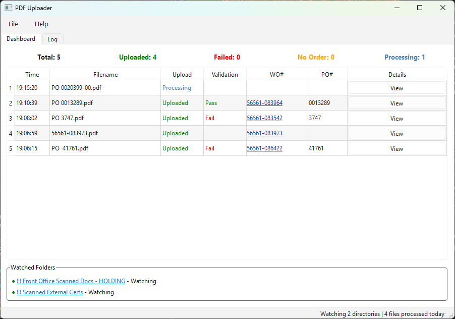
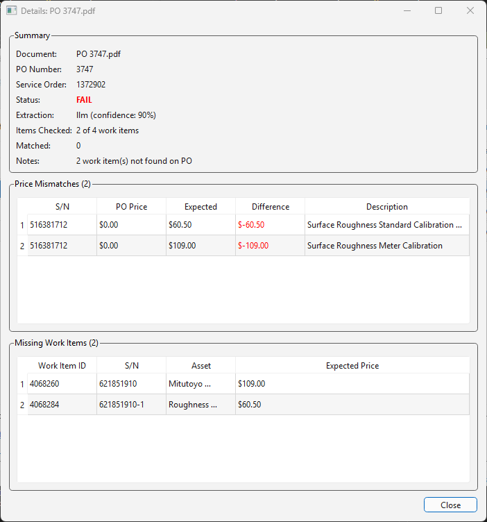
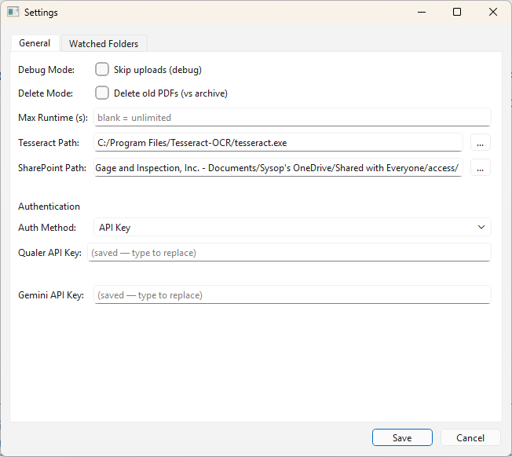
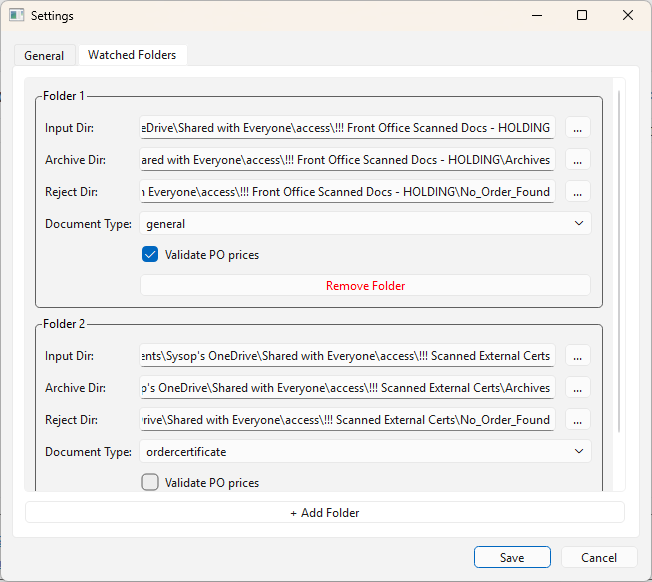
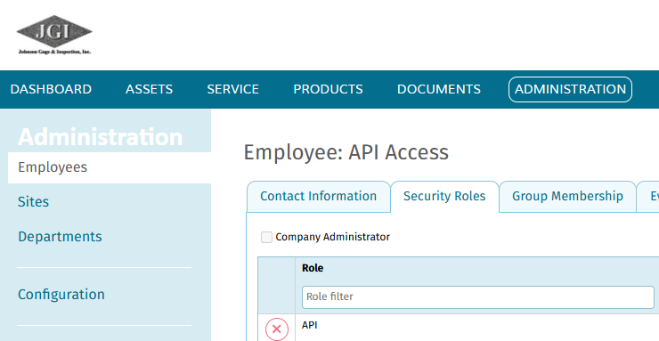

<h1 align="center">PDF Processor and Uploader</h1>
<p align="center">
  <em>Watches for scanned PDFs, matches them to Qualer work orders, and uploads automatically.</em>
</p>
<p align="center">
  <a href="https://github.com/Johnson-Gage-Inspection-Inc/pdf_uploader/releases/latest"></a>
  
  
</p>

<p align="center">
  
</p>

---

## Table of Contents

- [Overview](#overview)
- [Features](#features)
- [Screenshots](#screenshots)
- [Getting Started](#getting-started)
- [Usage](#usage)
- [How It Works](#how-it-works)
- [Project Structure](#project-structure)
- [Contributing](#contributing)
- [Acknowledgments](#acknowledgments)

---

## Overview

PDF Uploader is a Windows desktop application for [Johnson Gage & Inspection](https://jgiquality.qualer.com). It monitors shared OneDrive folders for scanned PDF documents, identifies work order or purchase order numbers from filenames and content, and uploads each document to the correct service order in [Qualer](https://www.qualer.com/) — the company's calibration management system.

The app runs as a **PyQt6 GUI** (with system tray support) or as a **headless CLI**, and is distributed as a single-file `.exe` via PyInstaller.

**Key capabilities:**

- **Automatic upload** — watches folders and uploads new PDFs to Qualer without manual intervention
- **Work order detection** — extracts WO numbers from PDF filenames and body text (OCR fallback if needed)
- **Purchase order validation** — compares PO line items against Qualer work items, generates annotated PDFs with pass/fail stamps
- **Multi-instance safety** — atomic claim-by-move prevents duplicate processing when multiple machines watch the same OneDrive folder
- **PDF correction** — auto-detects and fixes page orientation; splits multi-WO documents into separate files

---

## Features

| Feature | Description |
|---------|-------------|
| **GUI Dashboard** | Live summary counters, file table with clickable WO# hyperlinks to Qualer, and minimize-to-tray support |
| **PO Validation** | Extracts PO line items (via Gemini AI + pdfplumber), compares prices against Qualer, and uploads annotated pass/fail PDFs |
| **PDF Correction** | Backup OCR via Tesseract, orientation detection/correction, multi-WO page splitting |
| **Directory Watching** | Monitors configured folders via watchdog; waits for file stability before processing |
| **Multi-Instance Safety** | Atomic claim-by-move into `_processing/` dir; PermissionError retry for OneDrive/antivirus locks |
| **Connectivity Monitoring** | Checks internet, SharePoint, and Qualer availability; pauses/resumes automatically |
| **Configurable** | YAML-based config with `{sharepoint_path}` interpolation; runtime settings dialog in the GUI |

---

## Screenshots

### Dashboard

The dashboard shows real-time processing status with summary counters and a file table. Click any work order number to open it directly in Qualer.


### Details Pane

Click the **View** button on any row to see upload details. For PO files, this shows the full validation breakdown — matched items, price mismatches, and missing work items.



### Settings

Configure general options and watched folders from the GUI. Changes are saved to `config.yaml`.

| General | Watched Folders |
|---------|-----------------|
|  |  |

---

## Getting Started

### Download

To use PDF Uploader without building from source, download the latest `.exe` from the [Releases page](https://github.com/Johnson-Gage-Inspection-Inc/pdf_uploader/releases/latest).

### Build from Source

**Prerequisites:**
- Python 3.14+
- [Tesseract OCR](https://github.com/tesseract-ocr/tesseract) (configure path in `config.yaml`)

```sh
git clone https://github.com/Johnson-Gage-Inspection-Inc/pdf_uploader
cd pdf_uploader
python -m venv .venv
.venv\Scripts\activate          # Windows
pip install -r requirements.txt
```

Verify the setup:

```sh
pytest
```

Build a standalone `.exe`:

```sh
pyinstaller PDF_Uploader.spec --noconfirm
```

### Configuration

#### 1. Credentials

Create a `.env` file in the project root:

```env
QUALER_API_KEY=your-uuid-api-key
GEMINI_API_KEY=your-gemini-key    # optional, for PO validation
```

Or use username/password authentication:

```env
QUALER_AUTH_MODE=credentials
QUALER_USERNAME=your_username
QUALER_PASSWORD=your_password
```

The Qualer user must have the **API security role** in [Employee Settings](https://jgiquality.qualer.com/Company/Employees):



Contact Jeff or Johnny if you need these credentials.

> For the compiled `.exe`, secrets are stored encrypted in `secrets.enc` using the OS keychain — no `.env` file needed on the target machine.

#### 2. Settings

Edit `config.yaml` (or use the [Settings dialog](#settings) in the GUI):

```yaml
max_runtime: null              # null = run forever, or seconds
debug: false                   # true = skip actual uploads
delete_mode: false             # true = delete after upload, false = archive
tesseract_cmd_path: "C:/Program Files/Tesseract-OCR/tesseract.exe"

sharepoint_path: "~/Johnson Gage and Inspection, Inc/..."
log_file: "{sharepoint_path}Logs/pdfUploader.log"
po_dict_file: "{sharepoint_path}Logs/DoNotMoveThisFile.json.gz"

watched_folders:
  - input_dir: "{sharepoint_path}!!! Front Office Scanned Docs - HOLDING"
    output_dir: "{sharepoint_path}!!! Front Office Scanned Docs - HOLDING/Archives"
    reject_dir: "{sharepoint_path}!!! Front Office Scanned Docs - HOLDING/No_Order_Found"
    qualer_document_type: "General"
    validate_po: true
  - input_dir: "{sharepoint_path}!!! Scanned External Certs"
    output_dir: "{sharepoint_path}!!! Scanned External Certs/Archives"
    reject_dir: "{sharepoint_path}!!! Scanned External Certs/No_Order_Found"
    qualer_document_type: "ordercertificate"
    validate_po: false
```

Paths support `~` (home directory) expansion and `{sharepoint_path}` interpolation.

---

## Usage

**GUI mode** (default for `.exe`):

```sh
python watcher.py --gui
# or just run the compiled executable:
PDF_Uploader.exe
```

**CLI mode** (default when running from source):

```sh
python watcher.py
# or explicitly:
python watcher.py --cli
```

---

## How It Works

```
Scanned PDF lands in watched folder
        │
        ▼
   watcher.py detects file (watchdog)
   waits for file stability
        │
        ▼
   upload.process_file()
   ├─ Claim-by-move → _processing/ dir (atomic, multi-instance safe)
   ├─ Filename starts with "PO"?
   │   ├─ YES → Look up PO in dictionary → upload to all matching SOs
   │   │        → Run PO validation (if enabled) → upload annotated PDF
   │   └─ NO  → Extract WO# from filename/body (OCR fallback)
   │            → Look up SO via API → upload
   └─ Result:
       ├─ Success → archive file, emit ProcessingEvent to GUI
       └─ Failure → move to reject dir, log error
```

**Document types by folder:**
- **Front Office scans** → uploaded as `General` documents (PO validation enabled)
- **External Certs** → uploaded as `ordercertificate` documents

---

## Project Structure

```
pdf_uploader/
├── watcher.py                # Entry point — CLI or GUI mode
├── upload.py                 # Core processing: claim, detect WO/PO, upload, archive
├── config.yaml               # Main configuration file
├── .env                      # Credentials (create this yourself)
├── app/
│   ├── api.py                # Qualer API gateway (all SDK calls)
│   ├── auth.py               # Authentication (API key or username/password)
│   ├── config.py             # Config facade (PEP 562 __getattr__)
│   ├── config.pyi            # Type stub for config.py
│   ├── config_manager.py     # YAML config loader (AppConfig, WatchedFolder)
│   ├── color_print.py        # Colorized logging → console + log file + GUI
│   ├── connectivity.py       # Network availability checks
│   ├── event_bus.py          # Qt signal bus for GUI updates
│   ├── job_queue.py          # ThreadPoolExecutor job queue (GUI mode)
│   ├── qualer_client.py      # Thread-safe AuthenticatedClient singleton
│   ├── pdf.py                # PDF text extraction, WO detection, splitting
│   ├── orientation.py        # PDF orientation detection/correction
│   ├── archive.py            # File archiving (zip old files)
│   ├── PurchaseOrders.py     # PO dictionary, SO→WO cache
│   ├── file_ops.py           # File move/rename utilities
│   ├── version.py            # Build version tag
│   ├── gui/
│   │   ├── main_window.py    # Main window (tabs + tray)
│   │   ├── dashboard_widget.py  # Dashboard tab
│   │   ├── detail_dialog.py  # File detail / PO validation dialog
│   │   ├── log_widget.py     # Log viewer tab
│   │   ├── config_dialog.py  # Settings dialog
│   │   ├── tray_icon.py      # System tray icon
│   │   └── resources.py      # Icons & resources
│   └── po_validator/
│       ├── __init__.py       # validate_and_annotate() entry point
│       ├── extractor.py      # PO line item extraction (Gemini AI)
│       ├── annotator.py      # PDF annotation with stamps
│       ├── models.py         # Pydantic data models
│       ├── reporter.py       # Validation reporting
│       └── stamps/           # Approved/Rejected/Inconclusive PNGs
├── tests/                    # pytest + unittest.mock test suite
├── stubs/                    # Type stubs for untyped dependencies
├── hooks/                    # PyInstaller collection hooks
├── PDF_Uploader.spec         # PyInstaller build spec
└── requirements.txt
```

---

## Contributing

- **💬 [Discussions](https://github.com/Johnson-Gage-Inspection-Inc/pdf_uploader/discussions)** — questions, feedback, ideas
- **🐛 [Issues](https://github.com/Johnson-Gage-Inspection-Inc/pdf_uploader/issues)** — bug reports and feature requests
- **💡 [Pull Requests](https://github.com/Johnson-Gage-Inspection-Inc/pdf_uploader/blob/main/CONTRIBUTING.md)** — contributions welcome

<details>
<summary>Contributing Guidelines</summary>

1. Fork the repository
2. Clone locally: `git clone https://github.com/Johnson-Gage-Inspection-Inc/pdf_uploader`
3. Create a branch: `git checkout -b my-feature`
4. Make changes and test: `pytest`
5. Commit: `git commit -m 'Add my feature'`
6. Push: `git push origin my-feature`
7. Open a Pull Request against `main`

</details>

<details>
<summary>Contributors</summary>
<p align="left">
  <a href="https://github.com/Johnson-Gage-Inspection-Inc/pdf_uploader/graphs/contributors">
    
  </a>
</p>
</details>

---

## Acknowledgments

- Jeff Hall, Brian Vogt